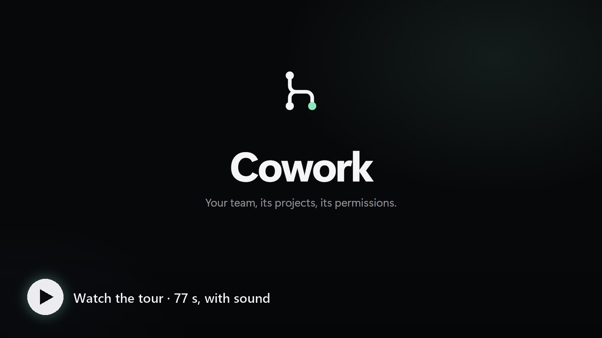
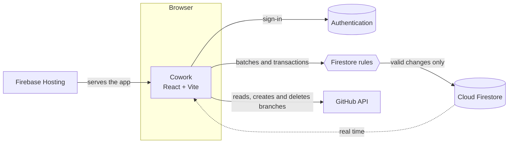
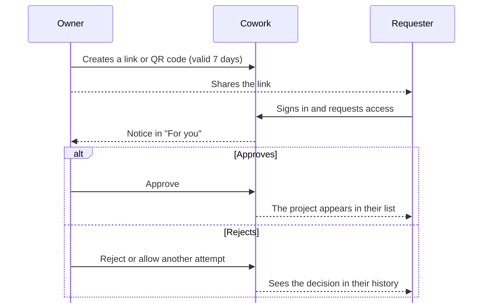

<p align="center"></p>

<h1 align="center">Cowork</h1>

<p align="center"><strong>A shared space to coordinate projects, tasks and team activity.</strong></p>

<p align="center"><a href="README.md">Español</a> · <strong>English</strong></p>

<!-- The version badge mirrors VERSION: `npm run version:bump` updates it (AGENTS.md, «Versiones»). -->
<p align="center">
  <a href="CHANGELOG.md"></a>
  <a href="https://react.dev"></a>
  <a href="https://www.typescriptlang.org"></a>
  <a href="https://vite.dev"></a>
  <a href="https://firebase.google.com"></a>
  <br>
  
  <a href="LICENSE"></a>
</p>

<p align="center">
  <a href="#video">Video</a> &bull;
  <a href="#overview">Overview</a> &bull;
  <a href="#features">Features</a> &bull;
  <a href="https://cwspace.web.app/novedades">What's new</a> &bull;
  <a href="#run-locally">Run locally</a> &bull;
  <a href="#tests">Tests</a> &bull;
  <a href="#versions">Versions</a> &bull;
  <a href="#deploy">Deploy</a>
</p>

<p align="center"><sub>Spanish is the main language; the documentation in <code>docs/</code> is written in Spanish.</sub></p>

---

<a id="video"></a>

<p align="center"><a href="docs/video/cowork-tour-en.mp4"></a></p>

<p align="center"><sub>The 77-second tour, with sound · <a href="docs/video/cowork-tour-es.mp4">en español</a> · <a href="docs/video/cowork-tour-en.mp4">download the MP4</a></sub></p>

## Overview

**Cowork** is a private workspace for coordinating each team's projects, tasks and repository activity. Every installation connects its own Firebase project; this source tree contains no projects, members or records from any installation. After signing in, each person only sees the projects they belong to.

## Features

- Private project list scoped to the signed-in account, with accent-insensitive search, favourites, a personal order, detected site favicons and animated project previews. On and Reduced override the system setting; System follows the device preference.
- Shareable access links and QR codes: people request access and the owner approves, rejects or allows another attempt, with a history of every decision. Ownership can be transferred.
- Kanban board (drag and drop or keyboard) or list by phase, with even spacing between the board, release proposals and milestones; every task has a description, priority, due date, checklist and branch, and the board filters by text, assignee, status, milestone, priority and date ([docs/TASKS.md](docs/TASKS.md)). Milestones have a date and time zone, and their progress comes from linked tasks.
- Optional delivery window with a live countdown, or an ambient pixel-art scene when there is no deadline.
- Activity center: a "For you" inbox and the team's change log, with read state synced across devices.
- Streaks and friends: UTC calendar, goals and badges, one-day protectors and seven-day shields, up to five friend pairs through [friend codes](docs/FRIEND-CODES.md) and preset nudges. Each new day gets a celebration card with an animated flame, a clear counter and a dedicated row for the "View my progress" button.
- Pixel-art collection unlocked with active days or bought with points.
- Branches and changes: one list with the registered branches and GitHub's, with each one's pull request, how far it drifted from the main branch, its commits and its tasks; register, create on GitHub, delete and remove from the register.
- Code: browse any branch or tag with [Material Icon Theme](https://github.com/material-extensions/vscode-material-icon-theme) icons (MIT), syntax highlighting, change marks and line links, under a GitHub-like bar (branch and tag picker, "Go to file" with the `T` key, clone over HTTPS, SSH or GitHub CLI, ZIP download). Images and SVGs get a preview ([docs/CODE-VIEWER.md](docs/CODE-VIEWER.md)).
- Files under review: creating or uploading a file in Cowork leaves it pending; someone with write access approves it and it is committed to GitHub with their account, or rejects it with a reason.
- What's new: every version, feature by feature, at [/novedades](https://cwspace.web.app/novedades), a public page in Spanish and English with system, light and dark themes, a neutral gray/black glow below the header, a green eyebrow label, and a fixed black logo with a white mark, linked from the home page footer.
- Project release notes to tasks: configure a public release notes page and Cowork reads each version's kind (Major, Feature or Fix) with distinct badges and marks Unreleased in blue, as well as each card's group (New, Changed or Fixed), recognizes statuses, and creates or updates tasks only after you accept each proposal. If CORS blocks access, it tells you which origin to allow.
- GitHub: sign in with GitHub or link it, see the repository's branches and recent commits (private repositories too), and delete branches after a confirmation. The owner decides whether only they or the whole team may change branches.

### What counts for streaks and points

| Action | Active day | Points |
|---|:---:|:---:|
| Create a task | ✓ | 1 |
| Change a task's status | ✓ | 1 |
| Register a new branch (once per name and project) | ✓ | 1 |
| Create a project | ✓ | — |

At most 3 points per UTC day across all projects and devices; each day counts once. Creating the branch in GitHub as well gives no extra points: it counts as registering it. When a day is added, the celebration card brings in the animated flame and keeps a soft glow at rest, with the "View my progress" button on its own row below the counter.

### Connecting GitHub

Each person can sign in with GitHub or link it from their profile. Cowork then reads the repository with that person's account, so private repositories they can access work and the rate limit is per account. The token only lives in the browser tab and is never stored in Firestore; when it expires or is revoked, Cowork asks to reconnect.

Creating or deleting branches from Cowork needs both the project's policy (**Owner only**, the default, or **All members**, under Settings → GitHub) and write access to the repository on GitHub. The default branch and protected branches are never deleted from Cowork. Setup of the GitHub OAuth App is described in [docs/GITHUB.md](docs/GITHUB.md).

### Work plan

The task board, release proposals and milestones have even spacing. The loading layout keeps the same rhythm so the page stays steady as data arrives.

### Syncing project release notes

The owner can save a release notes URL under Settings → Release notes. Cowork reads HTML pages, Markdown or CHANGELOG files, and GitHub releases when the page allows browser requests (CORS). If the browser blocks access, the message shows Cowork's exact origin to allow, both in production and during local testing. Sync starts when the task board opens and can also be run manually.

Each item appears as a proposal shared with the team. The card keeps both the version kind (Major, Feature or Fix), distinguished with solid, mint and amber badges, and its group (New, Changed or Fixed); Unreleased appears in blue at the start. Cowork looks for an existing task by exact title and suggests linking it or creating one; you can choose the status. A person must approve each proposal before Cowork creates or updates a task. Sync never deletes tasks.

## Stack

- React 19, TypeScript and Vite, with lazily loaded views and shape-matching skeleton loaders ([docs/DESIGN.md](docs/DESIGN.md)).
- Firebase Authentication (email link, password and optional Google and GitHub) and Cloud Firestore. Every work change writes an immutable, server-timed event in the same operation, and the [security rules](firestore.rules) check that it describes the real change.
- Streaks and points use client transactions validated by the rules, with no Cloud Functions, so the app runs on the free Spark plan within its quotas.
- Firebase Hosting and the Firebase local emulators.
- GitHub's API, called from the browser, to read branches and commits and to create or delete branches, using each person's own GitHub token (kept in the browser tab, never in Firestore). Branch notes and the branch policy live in Firestore. See [docs/GITHUB.md](docs/GITHUB.md).



### Joining a project



## Run locally

Requirements: Node.js 22, Java 21 for the Firebase emulators, and your own Firebase web app configuration in `.env.local` (copy [.env.example](.env.example) and follow [docs/FIREBASE.md](docs/FIREBASE.md)). GitHub sign-in is optional and needs a GitHub OAuth App configured in Firebase Authentication ([docs/GITHUB.md](docs/GITHUB.md)); the Authentication emulator fakes GitHub locally.

```bash
npm ci
npm run dev
```

For Vite hot reload, keep `npm run dev:emulators` running in one terminal and run `npm run dev:vite` in another.

## Tests

All tests run against local emulators or `demo-*` projects, never production. The GitHub API is mocked in the end-to-end tests.

| Script | Coverage |
|---|---|
| `npm run test:unit` | Pure logic with Vitest. |
| `npm run test:streaks` | Spark backend through the client SDK against the real rules. |
| `npm run test:rules` | Firestore security rules. |
| `npm run test:e2e` | Playwright flows on Chromium, Firefox, WebKit and mobile against the build and the emulators. |
| `npm run test` | All of the above, in order. |

At minimum, run `npm run build` and `npm run test:unit` before submitting a change.

## Versions

The version lives in [`VERSION`](VERSION) and follows [SemVer](https://semver.org/): every commit that changes the app bumps a MINOR (new feature), a MAJOR (very large change) or a PATCH (fixes only). `npm run version:bump -- <major|minor|patch>` updates `package.json`, both READMEs and the [CHANGELOG](CHANGELOG.md) ([Keep a Changelog](https://keepachangelog.com/en/1.1.0/)); the public entry goes in [`releases.ts`](src/features/changelog/releases.ts), which feeds [/novedades](https://cwspace.web.app/novedades). `npm run version:check` and the GitHub `build` workflow fail when anything disagrees.

Pushing a `vX.Y.Z` tag runs `prepare-release`: it checks the tag against `VERSION` and the CHANGELOG, builds, runs the unit tests and creates a **draft** release with that version's notes. The full rules are in [AGENTS.md](AGENTS.md#versiones) (Spanish).

## Deploy

Link your Firebase project and Hosting site with the Firebase CLI (`.firebaserc` is local and ignored by Git), then run `npm run deploy`. When a change widens what the rules accept (for example a new event type or the GitHub branch policy), deploy the rules first and Hosting afterwards.

## Source layout

| Path | Contents |
|---|---|
| `src/features/` | One module per area: auth, projects, access, team, workboard, milestones, schedule, activity, repository, github, streaks, progress, personal, collection and ambient scene. |
| `src/features/github/` | GitHub session and token, API client, branch-name validation and branch permissions. |
| `src/components/` | Shared shell, navigation and skeleton loaders. |
| `src/pages/` | Project views: overview, branches and settings. |
| `src/styles/` | Design tokens and styles. |
| `firestore.rules`, `firestore.indexes.json` | Firestore security rules and indexes. |
| `tests/` | Unit, end-to-end, rules and backend tests. |
| `docs/` | Firebase setup, GitHub integration, design guide, streaks, friend codes, rules review, performance notes, the code page, tasks and the video (Spanish). |
| `CHANGELOG.md` | Technical changes of every version (Spanish). |
| `AGENTS.md` | Instructions for agents (Codex, Claude Code and others); `CLAUDE.md` imports it. |

## License

Cowork is released under the [MIT License](LICENSE).
