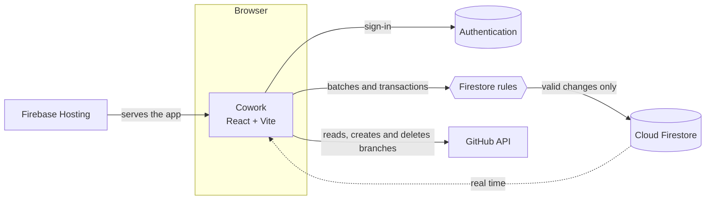
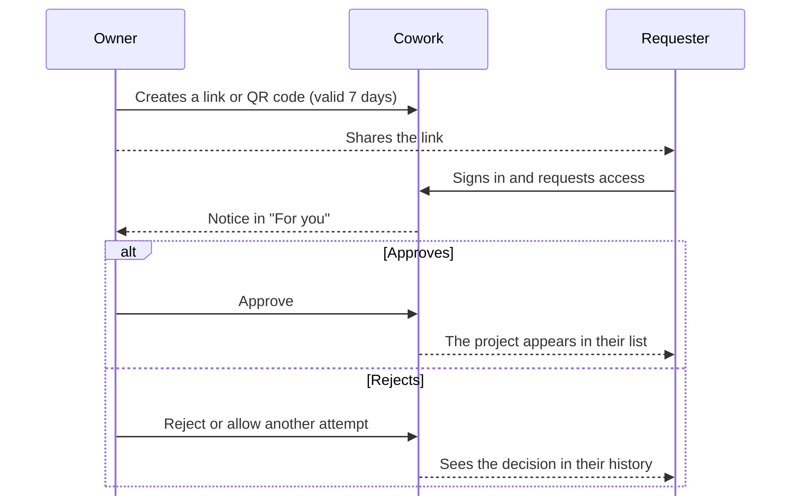

<p align="center"></p>

<h1 align="center">Cowork</h1>

<p align="center"><strong>A shared space to coordinate projects, tasks and team activity.</strong></p>

<p align="center"><a href="README.md">Español</a> · <strong>English</strong></p>

<!-- The version badge mirrors package.json: update both together. -->
<p align="center">
  <a href="package.json"></a>
  <a href="https://react.dev"></a>
  <a href="https://www.typescriptlang.org"></a>
  <a href="https://vite.dev"></a>
  <a href="https://firebase.google.com"></a>
  <br>
  
  <a href="LICENSE"></a>
</p>

<p align="center"><sub>Spanish is the main language; the documentation in <code>docs/</code> is written in Spanish.</sub></p>

---

## Overview

**Cowork** is a private workspace for coordinating each team's projects, tasks and repository activity. Every installation connects its own Firebase project; this source tree contains no projects, members or records from any installation. After signing in, each person only sees the projects they belong to.

## Features

- Private project list scoped to the signed-in account, with accent-insensitive search, favourites and a personal order.
- Shareable access links and QR codes: people request access and the owner approves, rejects or allows another attempt, with a history of every decision. Ownership can be transferred.
- Task board with assignees, status and milestone filters; milestones with a date and time zone whose progress comes from linked tasks.
- Optional delivery window with a live countdown, or an ambient pixel-art scene when there is no deadline.
- Activity center: a "For you" inbox and the team's change log, with read state synced across devices.
- Streaks and friends: UTC calendar, goals and badges, one-day protectors and seven-day shields, up to five friend pairs through [friend codes](docs/FRIEND-CODES.md) and preset nudges.
- Pixel-art collection unlocked with active days or bought with points.
- Branch notes: record which branch each person works on and why, and, when allowed, create that branch in GitHub in the same step.
- GitHub: sign in with GitHub or link it, see the repository's branches and recent commits (private repositories too), and delete branches after a confirmation. The owner decides whether only they or the whole team may change branches.

### What counts for streaks and points

| Action | Active day | Points |
|---|:---:|:---:|
| Create a task | ✓ | 1 |
| Change a task's status | ✓ | 1 |
| Register a new branch (once per name and project) | ✓ | 1 |
| Create a project | ✓ | — |

At most 3 points per UTC day across all projects and devices; each day counts once. Creating the branch in GitHub as well gives no extra points: it counts as registering it.

### Connecting GitHub

Each person can sign in with GitHub or link it from their profile. Cowork then reads the repository with that person's account, so private repositories they can access work and the rate limit is per account. The token only lives in the browser tab and is never stored in Firestore; when it expires or is revoked, Cowork asks to reconnect.

Creating or deleting branches from Cowork needs both the project's policy (**Owner only**, the default, or **All members**, under Settings → GitHub) and write access to the repository on GitHub. The default branch and protected branches are never deleted from Cowork. Setup of the GitHub OAuth App is described in [docs/GITHUB.md](docs/GITHUB.md).

## Stack

- React 19, TypeScript and Vite, with lazily loaded views and shape-matching skeleton loaders ([docs/DESIGN.md](docs/DESIGN.md)).
- Firebase Authentication (email link, password and optional Google and GitHub) and Cloud Firestore. Every work change writes an immutable, server-timed event in the same operation, and the [security rules](firestore.rules) check that it describes the real change.
- Streaks and points use client transactions validated by the rules, with no Cloud Functions, so the app runs on the free Spark plan within its quotas.
- Firebase Hosting and the Firebase local emulators.
- GitHub's API, called from the browser, to read branches and commits and to create or delete branches, using each person's own GitHub token (kept in the browser tab, never in Firestore). Branch notes and the branch policy live in Firestore. See [docs/GITHUB.md](docs/GITHUB.md).



### Joining a project



## Run locally

Requirements: Node.js 22, Java 21 for the Firebase emulators, and your own Firebase web app configuration in `.env.local` (copy [.env.example](.env.example) and follow [docs/FIREBASE.md](docs/FIREBASE.md)). GitHub sign-in is optional and needs a GitHub OAuth App configured in Firebase Authentication ([docs/GITHUB.md](docs/GITHUB.md)); the Authentication emulator fakes GitHub locally.

```bash
npm ci
npm run dev
```

For Vite hot reload, keep `npm run dev:emulators` running in one terminal and run `npm run dev:vite` in another.

## Tests

All tests run against local emulators or `demo-*` projects, never production. The GitHub API is mocked in the end-to-end tests.

| Script | Coverage |
|---|---|
| `npm run test:unit` | Pure logic with Vitest. |
| `npm run test:streaks` | Spark backend through the client SDK against the real rules. |
| `npm run test:rules` | Firestore security rules. |
| `npm run test:e2e` | Playwright flows on Chromium, Firefox, WebKit and mobile against the build and the emulators. |
| `npm run test` | All of the above, in order. |

At minimum, run `npm run build` and `npm run test:unit` before submitting a change.

## Deploy

Link your Firebase project and Hosting site with the Firebase CLI (`.firebaserc` is local and ignored by Git), then run `npm run deploy`. When a change widens what the rules accept (for example a new event type or the GitHub branch policy), deploy the rules first and Hosting afterwards.

## Source layout

| Path | Contents |
|---|---|
| `src/features/` | One module per area: auth, projects, access, team, workboard, milestones, schedule, activity, repository, github, streaks, progress, personal, collection and ambient scene. |
| `src/features/github/` | GitHub session and token, API client, branch-name validation and branch permissions. |
| `src/components/` | Shared shell, navigation and skeleton loaders. |
| `src/pages/` | Project views: overview, branches and settings. |
| `src/styles/` | Design tokens and styles. |
| `firestore.rules`, `firestore.indexes.json` | Firestore security rules and indexes. |
| `tests/` | Unit, end-to-end, rules and backend tests. |
| `docs/` | Firebase setup, GitHub integration, design guide, streaks, friend codes, rules review and performance notes (Spanish). |
| `AGENTS.md` | Instructions for agents (Codex, Claude Code and others); `CLAUDE.md` imports it. |

## License

Cowork is released under the [MIT License](LICENSE).
