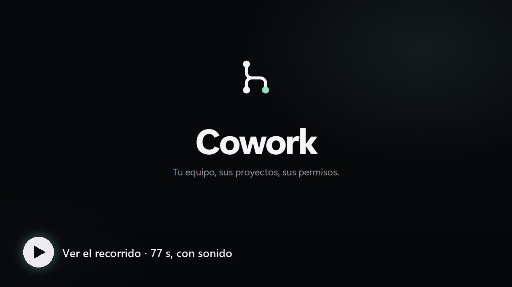
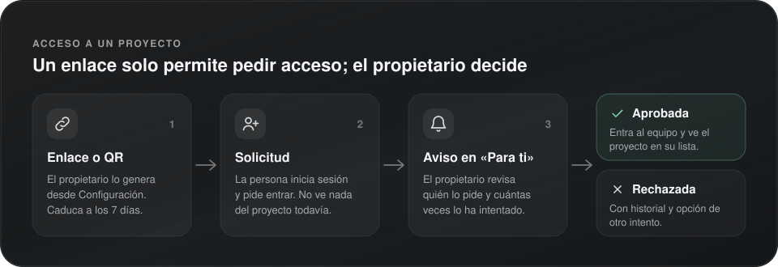
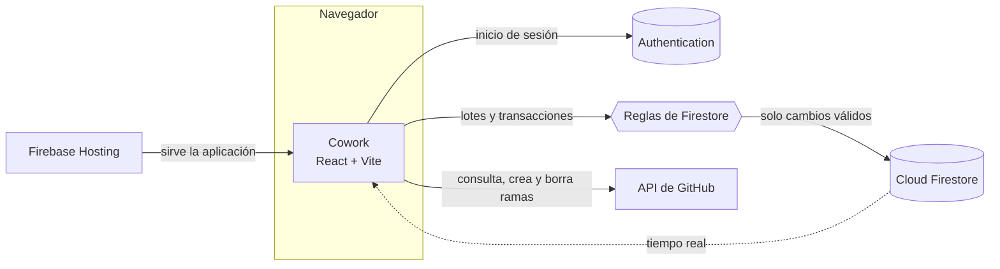
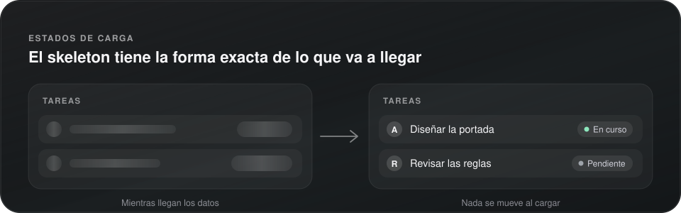
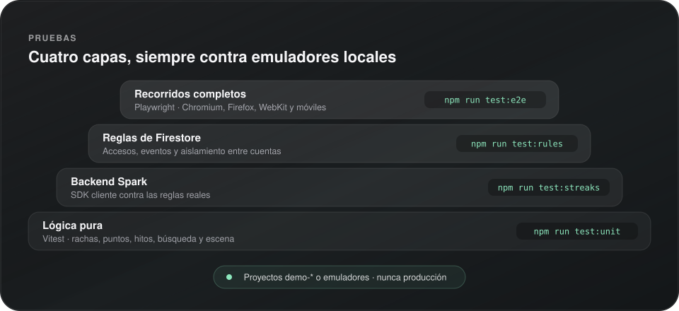

<p align="center"></p>

<h1 align="center">Cowork</h1>

<p align="center"><strong>Un espacio compartido para coordinar proyectos, tareas y actividad del equipo.</strong></p>

<p align="center"><strong>Español</strong> · <a href="README.en.md">English</a></p>

<!-- La placa de versión repite VERSION: la actualiza `npm run version:bump` (AGENTS.md, «Versiones»). -->
<p align="center">
  <a href="CHANGELOG.md"></a>
  <a href="https://react.dev"></a>
  <a href="https://www.typescriptlang.org"></a>
  <a href="https://vite.dev"></a>
  <a href="https://firebase.google.com"></a>
  <br>
  
  <a href="LICENSE"></a>
</p>

<p align="center">
  <a href="#video">Video</a> &bull;
  <a href="#resumen">Resumen</a> &bull;
  <a href="#funciones">Funciones</a> &bull;
  <a href="https://cwspace.web.app/novedades">Novedades</a> &bull;
  <a href="#arquitectura">Arquitectura</a> &bull;
  <a href="#inicio-rápido">Inicio rápido</a> &bull;
  <a href="#pruebas">Pruebas</a> &bull;
  <a href="#versiones">Versiones</a> &bull;
  <a href="#publicar">Publicar</a> &bull;
  <a href="#estructura">Estructura</a> &bull;
  <a href="#documentación">Documentación</a> &bull;
  <a href="#licencia">Licencia</a>
</p>


---

<a id="video"></a>

<p align="center"><a href="docs/video/cowork-tour-es.mp4"></a></p>

<p align="center"><sub>El recorrido de 77 segundos, con sonido · <a href="docs/video/cowork-tour-en.mp4">in English</a> · <a href="docs/video/cowork-tour-es.mp4">descargar el MP4</a></sub></p>

## Resumen

**Cowork** es un espacio privado para coordinar proyectos, tareas y la actividad del repositorio de cada equipo. Cada instalación conecta su propio proyecto de Firebase; el código no incluye proyectos, miembros ni registros de ninguna instalación.

La portada presenta Cowork sin exponer información del equipo. Para crear o abrir un espacio se inicia sesión, y cada persona ve únicamente los proyectos a los que pertenece.

## Funciones

| Área | Qué permite hacer |
|---|---|
| Proyectos privados | Crear espacios y ver solo los proyectos a los que pertenece tu cuenta. |
| Equipos por proyecto | Compartir un enlace o QR para solicitar acceso; el propietario aprueba, rechaza o permite un nuevo intento, con historial de cada decisión. La propiedad se puede transferir a un miembro activo. |
| Resumen del proyecto | Tus tareas abiertas, el avance, el próximo hito, la actividad reciente, el repositorio y el código de un vistazo, con pasos pendientes para el propietario. |
| Tablero de tareas | Tablero por estado (arrastrando, con el teclado o con el select) o lista por fases, con espacios uniformes entre el tablero, las propuestas de novedades y los hitos. Cada tarea tiene descripción, prioridad, fecha límite, lista de pasos y rama. Se filtra por texto, responsable, estado, hito, prioridad y fecha. Ver [docs/TASKS.md](docs/TASKS.md). |
| Hitos | Dividir la entrega en hitos con fecha y zona horaria; su avance se calcula con las tareas vinculadas. |
| Plazo de entrega | Cuenta regresiva hasta el final del último día en la zona horaria del proyecto, o una escena pixel art cuando no hay fecha. |
| Actividad | Bandeja «Para ti» (solicitudes, decisiones, tus tareas y entregas próximas) y registro de cambios del equipo, con estado de lectura sincronizado entre dispositivos. |
| Selector de proyectos | Búsqueda sin distinguir acentos, favoritos, orden personal, vistas previas rotativas y favicon detectados del sitio. «Activado» y «Reducido» prevalecen sobre el sistema; «Sistema» sigue la preferencia del dispositivo. |
| Rachas y amigos | Calendario UTC, metas e insignias, protectores de un día y escudos de siete días, hasta cinco parejas con [códigos de amigo](docs/FRIEND-CODES.md) y toques con frases predefinidas. La celebración de cada nuevo día muestra una llama animada, el contador y el botón «Ver mi progreso» en una fila propia. |
| Mi colección | Personajes y paisajes pixel art: unos se desbloquean con días activos acumulados y otros se compran con puntos. |
| Ramas y cambios | Una sola lista con las ramas del registro y las de GitHub: dónde existe cada una, su pull request, cuánto se ha separado de la principal, sus commits y sus tareas. Permite registrar, crear en GitHub, borrar y quitar del registro. |
| Código | Explorador de archivos de cualquier rama o etiqueta, con los iconos de lenguajes de [Material Icon Theme](https://github.com/material-extensions/vscode-material-icon-theme) (MIT), resaltado de sintaxis, marcas de cambios y enlaces a líneas. Una barra como la de GitHub: selector de rama o etiqueta, «Ir a archivo» con la tecla `T`, clonar por HTTPS, SSH o GitHub CLI y descargar el ZIP. Las imágenes y los SVG tienen vista previa. Ver [docs/CODE-VIEWER.md](docs/CODE-VIEWER.md). |
| Archivos en revisión | Crear o subir un archivo desde Cowork lo deja pendiente de revisión; quien puede escribir en el repositorio lo aprueba y se sube a GitHub con su cuenta, o lo rechaza con un motivo. |
| Novedades | Cada versión, función por función, en [/novedades](https://cwspace.web.app/novedades): página pública en español e inglés, con temas del sistema, claro u oscuro, resplandor gris/negro a todo el ancho y pegado bajo la cabecera, rótulo en verde y logo fijo en negro con símbolo blanco, enlazada desde el pie de la portada. |
| Novedades del proyecto en tareas | Configura una página pública de novedades: Cowork lee el tipo de cada versión (Major, Feature o Fix) con badges de distinto color y marca Unreleased en azul, además del grupo de cada tarjeta (Nuevo, Cambios o Arreglos), detecta estados y crea o actualiza tareas solo cuando aceptas cada propuesta. Si CORS bloquea el acceso, indica el origen que debe permitirse. |
| Portafolio manga de Linus | Una página pública en español e inglés relata en viñetas la historia de Linux, la colaboración abierta y Git, con ilustraciones originales, cronología y fuentes enlazadas. Se adapta a móvil, tableta y escritorio sin desplazamiento horizontal. [Abrir el portafolio](https://cwspace.web.app/linus-portfolio/). |
| GitHub | Iniciar sesión o vincular GitHub, consultar ramas y commits del repositorio (también privados), y borrar ramas con confirmación. Quien es propietario del proyecto elige si pueden modificar ramas solo esa cuenta o todo el equipo. |

### Portafolio manga de Linus Torvalds

La página pública [cwspace.web.app/linus-portfolio](https://cwspace.web.app/linus-portfolio/) presenta en viñetas el primer anuncio de Linux, su desarrollo comunitario y Git como caso de estudio. Incluye ilustraciones SVG originales, cronología, fuentes enlazadas, selector español/inglés y una nota de independencia y no afiliación. Su composición se adapta a móvil, tableta y escritorio sin desplazamiento horizontal.

### Qué cuenta para la racha y los puntos

<p align="center"></p>

<details>
<summary>Ver como tabla</summary>

| Acción | Día activo | Puntos |
|---|:---:|:---:|
| Crear una tarea | ✓ | 1 |
| Cambiar el estado de una tarea | ✓ | 1 |
| Registrar una rama nueva (una vez por nombre y proyecto) | ✓ | 1 |
| Crear un proyecto | ✓ | — |

Crear la rama también en GitHub no da puntos extra: cuenta como registrarla.

</details>

Cada día cuenta una sola vez, aunque haya varias acciones. Los protectores de un día y los escudos de siete días conservan la racha cuando no hay actividad, pero no la aumentan:

<p align="center"></p>

Al sumar un día, la tarjeta de celebración entra con la llama animada y mantiene un brillo suave cuando queda en reposo; el botón «Ver mi progreso» ocupa una fila propia bajo el contador. Los detalles están en [docs/STREAKS.md](docs/STREAKS.md).

### Conectar GitHub

Cada persona puede entrar con GitHub o vincularlo desde su perfil. Con GitHub conectado, Cowork consulta el repositorio con la cuenta de esa persona: ve los repositorios privados a los que tiene acceso y el límite de consultas es el de su cuenta. El token solo vive en la pestaña del navegador y nunca se guarda en Firestore; si caduca o se revoca, Cowork pide reconectar.

Para crear o borrar ramas desde Cowork hacen falta dos cosas: que la política del proyecto lo permita (**Solo el propietario**, por defecto, o **Todos los miembros**, en Configuración → GitHub) y que la cuenta tenga permiso de escritura en el repositorio de GitHub. La rama principal y las protegidas nunca se borran desde Cowork. Los detalles y la configuración de la OAuth App están en [docs/GITHUB.md](docs/GITHUB.md).

### Plan de trabajo

El tablero, las propuestas de novedades y los hitos tienen una separación uniforme, también en la estructura de carga para que el diseño no salte al recibir datos.

### Sincronizar las novedades del proyecto

El propietario puede guardar la URL de novedades en Configuración → Novedades. Cowork lee páginas HTML, archivos Markdown o CHANGELOG y releases de GitHub cuando la página permite solicitudes desde el navegador (CORS). Si el navegador bloquea la lectura, el aviso muestra el origen exacto de Cowork que debe autorizarse, tanto en producción como en una prueba local. La sincronización se inicia al abrir el tablero de tareas y también se puede ejecutar manualmente.

Cada elemento encontrado aparece como una propuesta compartida con el equipo. La tarjeta conserva tanto el tipo de la versión (Major, Feature o Fix), distinguido con badges sólido, menta y ámbar, como su grupo (Nuevo, Cambios o Arreglos); Unreleased aparece en azul al inicio. Cowork busca una tarea existente por título exacto y sugiere vincularla o crear una; puedes elegir el estado. Una persona debe aprobar cada propuesta antes de que Cowork cree o actualice una tarea. La sincronización no borra tareas.

### Cómo entra alguien a un proyecto

<p align="center"></p>

## Arquitectura

- **Interfaz:** React 19, TypeScript y Vite. Las páginas, diálogos y el selector se cargan bajo demanda, con *skeletons* según [docs/DESIGN.md](docs/DESIGN.md).
- **Acceso:** Firebase Authentication con enlace por correo, contraseña y, opcionalmente, Google y GitHub.
- **Datos:** Cloud Firestore. Cada cambio de trabajo guarda en la misma operación un evento inmutable con la hora del servidor, y las [reglas de seguridad](firestore.rules) comprueban que describe el cambio real.
- **Rachas y puntos sin backend propio:** transacciones del cliente validadas por las reglas. No usa Cloud Functions, así que funciona en el plan gratuito Spark, dentro de sus cuotas.
- **Alojamiento:** Firebase Hosting clásico, con emuladores locales para desarrollo y pruebas.
- **Repositorio:** API de GitHub desde el navegador para consultar ramas, commits, pull requests y archivos (con caché por ETag y por SHA) y para crear o borrar ramas, con el token de GitHub de cada persona (solo en la pestaña, nunca en Firestore). Los registros del equipo y la política de ramas se guardan en Firestore. Ver [docs/GITHUB.md](docs/GITHUB.md).
- **Sin conexión:** Cowork muestra el estado de la conexión y no guarda una copia paralela de los datos en el navegador.



Mientras llegan los datos, cada vista muestra un *skeleton* con la forma exacta del contenido final:

<p align="center"></p>

## Inicio rápido

### Requisitos

- Node.js 22.
- Java 21, para los emuladores de Firebase.
- Un proyecto de Firebase propio configurado en `.env.local` (copia [.env.example](.env.example) y sigue [docs/FIREBASE.md](docs/FIREBASE.md)).
- Opcional: una OAuth App de GitHub para el acceso con GitHub, configurada en Firebase Authentication ([docs/GITHUB.md](docs/GITHUB.md)). El emulador de Authentication simula GitHub en local.

### Ejecutar Cowork

```bash
npm ci
npm run dev
```

`npm run dev` compila la aplicación e inicia los emuladores de Hosting, Authentication y Firestore. La terminal muestra la dirección local de Hosting (normalmente `http://localhost:5000`); la consola de los emuladores suele estar en `http://localhost:4000`.

Para trabajar con la recarga rápida de Vite, deja los emuladores en una terminal y ejecuta Vite en otra:

```bash
# Terminal 1
npm run dev:emulators

# Terminal 2
npm run dev:vite
```

### Scripts

| Script | Qué hace |
|---|---|
| `npm run dev` | Compila para emuladores e inicia Hosting, Auth y Firestore locales. |
| `npm run dev:vite` | Servidor de desarrollo de Vite con recarga rápida. |
| `npm run build` | Comprueba los tipos y genera la versión de producción en `dist/`. |
| `npm run preview` | Sirve la compilación de `dist/`. |
| `npm run test` | Ejecuta unitarias, backend Spark, reglas y e2e, en ese orden. |
| `npm run deploy` | Compila y publica Hosting, reglas e índices en el proyecto de `.firebaserc`. |
| `npm run version:check` | Comprueba que la versión de `VERSION` coincide en `package.json`, los README, el CHANGELOG y `/novedades`. |
| `npm run version:bump -- minor` | Sube la versión (`major`, `minor` o `patch`) en todos esos sitios a la vez. |
| `npm run video:capture` | Captura las vistas del video de presentación con datos de ejemplo en los emuladores ([docs/VIDEO.md](docs/VIDEO.md)). |

## Pruebas

<p align="center"></p>

| Script | Cobertura |
|---|---|
| `npm run test:unit` | Lógica pura con Vitest: rachas, protección, puntos, hitos, búsqueda, códigos de amigo, motor de la escena, errores de la API de GitHub, nombres de rama y permisos de ramas. |
| `npm run test:streaks` | Backend Spark con el SDK cliente contra las reglas reales: acreditación concurrente, límite diario, compras, amigos y toques. |
| `npm run test:rules` | Reglas de Firestore: accesos, proyectos, política de GitHub, eventos, colección y aislamiento entre cuentas. |
| `npm run test:e2e` | Recorridos de Playwright en Chromium, Firefox, WebKit y móviles contra la compilación y los emuladores. La API de GitHub se simula; nunca se contacta a GitHub. |
| `npm run test:smoke` | Recorrido adicional de la interfaz de rachas y amigos. |

Antes de entregar un cambio, como mínimo: `npm run build` y `npm run test:unit`. Las pruebas e2e y de humo arrancan los emuladores con el identificador `vigilia-panel`; si tu `.env.local` usa otro, cambia `--project` en esos scripts y `E2E_FIREBASE_PROJECT_ID`. Hay dos fallos conocidos en la batería e2e completa, descritos en [docs/STREAKS.md](docs/STREAKS.md#validación-de-la-racha-por-creación-de-proyecto--29-de-septiembre-de-2026).

## Versiones

La versión vive en [`VERSION`](VERSION) y sigue [SemVer](https://semver.org/lang/es/): cada commit con cambios de la app sube un MINOR (función nueva), un MAJOR (cambio muy grande) o un PATCH (solo arreglos). `npm run version:bump` la sube en `package.json`, los README y el [CHANGELOG](CHANGELOG.md) ([Keep a Changelog](https://keepachangelog.com/es-ES/1.1.0/)); la entrada pública va en [`releases.ts`](src/features/changelog/releases.ts), que alimenta [/novedades](https://cwspace.web.app/novedades). `npm run version:check` y el flujo `build` de GitHub fallan si algo no coincide.

Al subir una etiqueta `vX.Y.Z`, el flujo `prepare-release` comprueba que coincide con `VERSION` y con el CHANGELOG, compila, pasa las pruebas y crea un **borrador** de release con las notas de esa versión. Las reglas completas están en [AGENTS.md](AGENTS.md#versiones).

## Publicar

1. Enlaza tu proyecto y tu sitio de Hosting con Firebase CLI (`firebase use --add` y `firebase target:apply hosting cowork TU_SITIO`). `.firebaserc` es local y no se sube al repositorio.
2. Ejecuta `npm run deploy`.

Si un cambio amplía lo que aceptan las reglas (por ejemplo, un tipo de evento nuevo o la política de ramas de GitHub), publica primero las reglas y después Hosting. Así la aplicación nueva nunca escribe algo que las reglas publicadas todavía rechazan:

```bash
npx firebase-tools deploy --only firestore:rules
npx firebase-tools deploy --only hosting:cowork
```

Para migrar datos de versiones anteriores, consulta [docs/FIREBASE.md](docs/FIREBASE.md).

## Estructura

| Ruta | Contenido |
|---|---|
| `src/App.tsx` | Arranque, sesión, catálogo de proyectos y navegación entre vistas. |
| `src/features/` | Un módulo por área: `auth`, `projects`, `access`, `team`, `workboard`, `milestones`, `schedule`, `activity`, `repository`, `github`, `streaks`, `progress`, `personal`, `collection` y `ambient`. |
| `src/features/github/` | Sesión y token de GitHub, cliente de la API, validación de nombres de rama y permisos de ramas. |
| `src/features/ambient/scene/` | Catálogo pixel art de la colección, con una escala común (`scale.ts`) comprobada por las pruebas. |
| `src/components/` | Piezas compartidas: shell, navegación, avatares, avisos y *skeletons* (`Skeleton.tsx`, `BootSkeleton.tsx`, `PageSkeletons.tsx`). |
| `src/pages/` | Vistas de un proyecto (resumen, ramas, código y configuración) y la página pública `/novedades`. |
| `src/features/changelog/releases.ts` | Las versiones de `/novedades`, en español e inglés. |
| `docs/video/` | El video de presentación y sus fuentes (capturas, escenas, render y banda sonora). |
| `src/styles/` | Tokens de diseño y estilos por superficie. |
| `firestore.rules`, `firestore.indexes.json` | Reglas de seguridad e índices de Firestore. |
| `tests/` | `unit/` (Vitest), `e2e/` (Playwright) y las pruebas de reglas y backend con emulador. |
| `public/` | Iconos y manifiesto de la aplicación. |
| `assets/` | Fondos de la pantalla de acceso. |
| `docs/` | Documentación del proyecto (ver abajo). |

## Documentación

| Documento | Tema |
|---|---|
| [docs/FIREBASE.md](docs/FIREBASE.md) | Configurar Firebase, migrar datos, publicar y modelo de datos. |
| [docs/GITHUB.md](docs/GITHUB.md) | Acceso con GitHub, OAuth App, token, repositorios privados, crear y borrar ramas y política de permisos. |
| [docs/DESIGN.md](docs/DESIGN.md) | Guía de diseño: lenguaje visual y *skeletons* obligatorios para los estados de carga. |
| [docs/STREAKS.md](docs/STREAKS.md) | Rachas, puntos, protección, amigos y validación. |
| [docs/FRIEND-CODES.md](docs/FRIEND-CODES.md) | Códigos de amigo y solicitudes. |
| [docs/FIRESTORE-SPARK-REVIEW.md](docs/FIRESTORE-SPARK-REVIEW.md) | Revisión de las reglas frente a intentos de falsificación. |
| [docs/PERFORMANCE.md](docs/PERFORMANCE.md) | Mejoras de rendimiento y mediciones. |
| [docs/CODE-VIEWER.md](docs/CODE-VIEWER.md) | Página Código, barra del repositorio y archivos en revisión. |
| [docs/TASKS.md](docs/TASKS.md) | Tablero, lista y detalle de las tareas. |
| [docs/VIDEO.md](docs/VIDEO.md) | Cómo se genera el video de presentación. |
| [CHANGELOG.md](CHANGELOG.md) | Cambios técnicos de cada versión. |
| [AGENTS.md](AGENTS.md) | Instrucciones para agentes (Codex, Claude Code y otros); `CLAUDE.md` lo importa. |

## Licencia

Cowork se distribuye bajo la [licencia MIT](LICENSE).

---

<p align="center"><em>Cada proyecto en contexto. Cada colaboración en marcha.</em></p>
