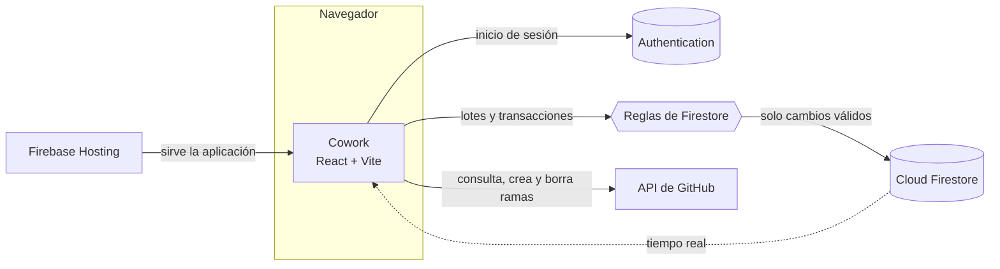

<p align="center"></p>

<h1 align="center">Cowork</h1>

<p align="center"><strong>Un espacio compartido para coordinar proyectos, tareas y actividad del equipo.</strong></p>

<p align="center"><strong>Español</strong> · <a href="README.en.md">English</a></p>

<!-- La placa de versión repite la de package.json: actualiza las dos a la vez. -->
<p align="center">
  <a href="package.json"></a>
  <a href="https://react.dev"></a>
  <a href="https://www.typescriptlang.org"></a>
  <a href="https://vite.dev"></a>
  <a href="https://firebase.google.com"></a>
  <br>
  
  <a href="LICENSE"></a>
</p>

<p align="center">
  <a href="#resumen">Resumen</a> &bull;
  <a href="#funciones">Funciones</a> &bull;
  <a href="#arquitectura">Arquitectura</a> &bull;
  <a href="#inicio-rápido">Inicio rápido</a> &bull;
  <a href="#pruebas">Pruebas</a> &bull;
  <a href="#publicar">Publicar</a> &bull;
  <a href="#estructura">Estructura</a> &bull;
  <a href="#documentación">Documentación</a> &bull;
  <a href="#licencia">Licencia</a>
</p>


---

## Resumen

**Cowork** es un espacio privado para coordinar proyectos, tareas y la actividad del repositorio de cada equipo. Cada instalación conecta su propio proyecto de Firebase; el código no incluye proyectos, miembros ni registros de ninguna instalación.

La portada presenta Cowork sin exponer información del equipo. Para crear o abrir un espacio se inicia sesión, y cada persona ve únicamente los proyectos a los que pertenece.

## Funciones

| Área | Qué permite hacer |
|---|---|
| Proyectos privados | Crear espacios y ver solo los proyectos a los que pertenece tu cuenta. |
| Equipos por proyecto | Compartir un enlace o QR para solicitar acceso; el propietario aprueba, rechaza o permite un nuevo intento, con historial de cada decisión. La propiedad se puede transferir a un miembro activo. |
| Tablero de tareas | Asignar tareas a miembros del equipo (o a ti), filtrar por responsable, estado e hito y consultar el progreso compartido. |
| Hitos | Dividir la entrega en hitos con fecha y zona horaria; su avance se calcula con las tareas vinculadas. |
| Plazo de entrega | Cuenta regresiva hasta el final del último día en la zona horaria del proyecto, o una escena pixel art cuando no hay fecha. |
| Actividad | Bandeja «Para ti» (solicitudes, decisiones, tus tareas y entregas próximas) y registro de cambios del equipo, con estado de lectura sincronizado entre dispositivos. |
| Selector de proyectos | Búsqueda sin distinguir acentos, favoritos y orden personal guardados en tu cuenta. |
| Rachas y amigos | Calendario UTC, metas e insignias, protectores de un día y escudos de siete días, hasta cinco parejas con [códigos de amigo](docs/FRIEND-CODES.md) y toques con frases predefinidas. |
| Mi colección | Personajes y paisajes pixel art: unos se desbloquean con días activos acumulados y otros se compran con puntos. |
| Ramas y cambios | Registrar en qué rama trabaja cada persona y el objetivo del cambio y, con permiso, crear esa rama en GitHub en el mismo paso. |
| GitHub | Iniciar sesión o vincular GitHub, consultar ramas y commits del repositorio (también privados), y borrar ramas con confirmación. Quien es propietario del proyecto elige si pueden modificar ramas solo esa cuenta o todo el equipo. |

### Qué cuenta para la racha y los puntos

<p align="center"></p>

<details>
<summary>Ver como tabla</summary>

| Acción | Día activo | Puntos |
|---|:---:|:---:|
| Crear una tarea | ✓ | 1 |
| Cambiar el estado de una tarea | ✓ | 1 |
| Registrar una rama nueva (una vez por nombre y proyecto) | ✓ | 1 |
| Crear un proyecto | ✓ | — |

Crear la rama también en GitHub no da puntos extra: cuenta como registrarla.

</details>

Cada día cuenta una sola vez, aunque haya varias acciones. Los protectores de un día y los escudos de siete días conservan la racha cuando no hay actividad, pero no la aumentan:

<p align="center"></p>

Los detalles están en [docs/STREAKS.md](docs/STREAKS.md).

### Conectar GitHub

Cada persona puede entrar con GitHub o vincularlo desde su perfil. Con GitHub conectado, Cowork consulta el repositorio con la cuenta de esa persona: ve los repositorios privados a los que tiene acceso y el límite de consultas es el de su cuenta. El token solo vive en la pestaña del navegador y nunca se guarda en Firestore; si caduca o se revoca, Cowork pide reconectar.

Para crear o borrar ramas desde Cowork hacen falta dos cosas: que la política del proyecto lo permita (**Solo el propietario**, por defecto, o **Todos los miembros**, en Configuración → GitHub) y que la cuenta tenga permiso de escritura en el repositorio de GitHub. La rama principal y las protegidas nunca se borran desde Cowork. Los detalles y la configuración de la OAuth App están en [docs/GITHUB.md](docs/GITHUB.md).

### Cómo entra alguien a un proyecto

<p align="center"></p>

## Arquitectura

- **Interfaz:** React 19, TypeScript y Vite. Las páginas, diálogos y el selector se cargan bajo demanda, con *skeletons* según [docs/DESIGN.md](docs/DESIGN.md).
- **Acceso:** Firebase Authentication con enlace por correo, contraseña y, opcionalmente, Google y GitHub.
- **Datos:** Cloud Firestore. Cada cambio de trabajo guarda en la misma operación un evento inmutable con la hora del servidor, y las [reglas de seguridad](firestore.rules) comprueban que describe el cambio real.
- **Rachas y puntos sin backend propio:** transacciones del cliente validadas por las reglas. No usa Cloud Functions, así que funciona en el plan gratuito Spark, dentro de sus cuotas.
- **Alojamiento:** Firebase Hosting clásico, con emuladores locales para desarrollo y pruebas.
- **Repositorio:** API de GitHub desde el navegador para consultar ramas y commits y para crear o borrar ramas, con el token de GitHub de cada persona (solo en la pestaña, nunca en Firestore). Los registros del equipo y la política de ramas se guardan en Firestore. Ver [docs/GITHUB.md](docs/GITHUB.md).
- **Sin conexión:** Cowork muestra el estado de la conexión y no guarda una copia paralela de los datos en el navegador.



Mientras llegan los datos, cada vista muestra un *skeleton* con la forma exacta del contenido final:

<p align="center"></p>

## Inicio rápido

### Requisitos

- Node.js 22.
- Java 21, para los emuladores de Firebase.
- Un proyecto de Firebase propio configurado en `.env.local` (copia [.env.example](.env.example) y sigue [docs/FIREBASE.md](docs/FIREBASE.md)).
- Opcional: una OAuth App de GitHub para el acceso con GitHub, configurada en Firebase Authentication ([docs/GITHUB.md](docs/GITHUB.md)). El emulador de Authentication simula GitHub en local.

### Ejecutar Cowork

```bash
npm ci
npm run dev
```

`npm run dev` compila la aplicación e inicia los emuladores de Hosting, Authentication y Firestore. La terminal muestra la dirección local de Hosting (normalmente `http://localhost:5000`); la consola de los emuladores suele estar en `http://localhost:4000`.

Para trabajar con la recarga rápida de Vite, deja los emuladores en una terminal y ejecuta Vite en otra:

```bash
# Terminal 1
npm run dev:emulators

# Terminal 2
npm run dev:vite
```

### Scripts

| Script | Qué hace |
|---|---|
| `npm run dev` | Compila para emuladores e inicia Hosting, Auth y Firestore locales. |
| `npm run dev:vite` | Servidor de desarrollo de Vite con recarga rápida. |
| `npm run build` | Comprueba los tipos y genera la versión de producción en `dist/`. |
| `npm run preview` | Sirve la compilación de `dist/`. |
| `npm run test` | Ejecuta unitarias, backend Spark, reglas y e2e, en ese orden. |
| `npm run deploy` | Compila y publica Hosting, reglas e índices en el proyecto de `.firebaserc`. |

## Pruebas

<p align="center"></p>

| Script | Cobertura |
|---|---|
| `npm run test:unit` | Lógica pura con Vitest: rachas, protección, puntos, hitos, búsqueda, códigos de amigo, motor de la escena, errores de la API de GitHub, nombres de rama y permisos de ramas. |
| `npm run test:streaks` | Backend Spark con el SDK cliente contra las reglas reales: acreditación concurrente, límite diario, compras, amigos y toques. |
| `npm run test:rules` | Reglas de Firestore: accesos, proyectos, política de GitHub, eventos, colección y aislamiento entre cuentas. |
| `npm run test:e2e` | Recorridos de Playwright en Chromium, Firefox, WebKit y móviles contra la compilación y los emuladores. La API de GitHub se simula; nunca se contacta a GitHub. |
| `npm run test:smoke` | Recorrido adicional de la interfaz de rachas y amigos. |

Antes de entregar un cambio, como mínimo: `npm run build` y `npm run test:unit`. Las pruebas e2e y de humo arrancan los emuladores con el identificador `vigilia-panel`; si tu `.env.local` usa otro, cambia `--project` en esos scripts y `E2E_FIREBASE_PROJECT_ID`. Hay dos fallos conocidos en la batería e2e completa, descritos en [docs/STREAKS.md](docs/STREAKS.md#validación-de-la-racha-por-creación-de-proyecto--29-de-septiembre-de-2026).

## Publicar

1. Enlaza tu proyecto y tu sitio de Hosting con Firebase CLI (`firebase use --add` y `firebase target:apply hosting cowork TU_SITIO`). `.firebaserc` es local y no se sube al repositorio.
2. Ejecuta `npm run deploy`.

Si un cambio amplía lo que aceptan las reglas (por ejemplo, un tipo de evento nuevo o la política de ramas de GitHub), publica primero las reglas y después Hosting. Así la aplicación nueva nunca escribe algo que las reglas publicadas todavía rechazan:

```bash
npx firebase-tools deploy --only firestore:rules
npx firebase-tools deploy --only hosting:cowork
```

Para migrar datos de versiones anteriores, consulta [docs/FIREBASE.md](docs/FIREBASE.md).

## Estructura

| Ruta | Contenido |
|---|---|
| `src/App.tsx` | Arranque, sesión, catálogo de proyectos y navegación entre vistas. |
| `src/features/` | Un módulo por área: `auth`, `projects`, `access`, `team`, `workboard`, `milestones`, `schedule`, `activity`, `repository`, `github`, `streaks`, `progress`, `personal`, `collection` y `ambient`. |
| `src/features/github/` | Sesión y token de GitHub, cliente de la API, validación de nombres de rama y permisos de ramas. |
| `src/features/ambient/scene/` | Catálogo pixel art de la colección, con una escala común (`scale.ts`) comprobada por las pruebas. |
| `src/components/` | Piezas compartidas: shell, navegación, avatares, avisos y *skeletons* (`Skeleton.tsx`, `BootSkeleton.tsx`, `PageSkeletons.tsx`). |
| `src/pages/` | Vistas de un proyecto: resumen, ramas y configuración. |
| `src/styles/` | Tokens de diseño y estilos por superficie. |
| `firestore.rules`, `firestore.indexes.json` | Reglas de seguridad e índices de Firestore. |
| `tests/` | `unit/` (Vitest), `e2e/` (Playwright) y las pruebas de reglas y backend con emulador. |
| `public/` | Iconos y manifiesto de la aplicación. |
| `assets/` | Fondos de la pantalla de acceso. |
| `docs/` | Documentación del proyecto (ver abajo). |

## Documentación

| Documento | Tema |
|---|---|
| [docs/FIREBASE.md](docs/FIREBASE.md) | Configurar Firebase, migrar datos, publicar y modelo de datos. |
| [docs/GITHUB.md](docs/GITHUB.md) | Acceso con GitHub, OAuth App, token, repositorios privados, crear y borrar ramas y política de permisos. |
| [docs/DESIGN.md](docs/DESIGN.md) | Guía de diseño: lenguaje visual y *skeletons* obligatorios para los estados de carga. |
| [docs/STREAKS.md](docs/STREAKS.md) | Rachas, puntos, protección, amigos y validación. |
| [docs/FRIEND-CODES.md](docs/FRIEND-CODES.md) | Códigos de amigo y solicitudes. |
| [docs/FIRESTORE-SPARK-REVIEW.md](docs/FIRESTORE-SPARK-REVIEW.md) | Revisión de las reglas frente a intentos de falsificación. |
| [docs/PERFORMANCE.md](docs/PERFORMANCE.md) | Mejoras de rendimiento y mediciones. |
| [AGENTS.md](AGENTS.md) | Instrucciones para agentes (Codex, Claude Code y otros); `CLAUDE.md` lo importa. |

## Licencia

Cowork se distribuye bajo la [licencia MIT](LICENSE).

---

<p align="center"><em>Cada proyecto en contexto. Cada colaboración en marcha.</em></p>
